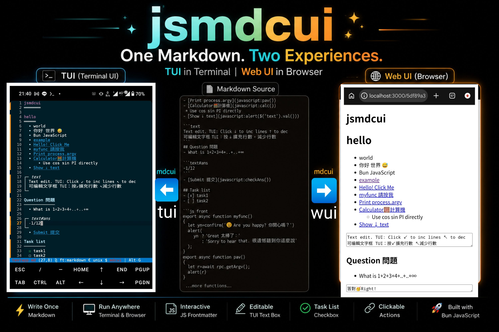

# Todo List

## Todos

- [ ] canvas support
- [x] push/pop/splice/slice list items
- [x] image by --kitty
- [ ] clean up codebase

## Actions

```text#todo-input
Fly to the moon
```

在上方輸入 Todo 文字，再選擇新增或移除。移除會刪除第一個文字完全相同的項目。

- [新增 Todo](javascript:addTodo())
- [移除 Todo](javascript:removeTodo())
- [顯示已完成](javascript:showCompleted())
- [顯示未完成](javascript:showPending())

## 操作結果：

```text#todo-status
尚未操作
```

## Filtered Result

```text#todo-result
點按「顯示已完成」或「顯示未完成」查看結果
```

```js front
function todoText() {
  return $('#todo-input').val().trim();
}

function showItems(title, checked) {
  const items = $('#todos')
    .slice()
    .filter(item => item.checked === checked);

  const output = items.length
    ? items.map(item => `${item.checked ? '✓' : '○'} ${item.value}`).join('\n')
    : '（沒有項目）';
  $('#todo-result').val(`${title}\n${output}`);
  $('#todo-status').val(`找到 ${items.length} 個${title}項目`);
}

export function addTodo() {
  const value = todoText();
  if (!value) {
    $('#todo-status').val('新增失敗：請先輸入 Todo 文字');
    return;
  }

  const length = $('#todos').push(value);
  $('#todo-input').val('');
  $('#todo-status').val(`已新增「${value}」，目前共有 ${length} 個 Todo`);
}

export function removeTodo() {
  const value = todoText();
  if (!value) {
    $('#todo-status').val('移除失敗：請輸入要移除的 Todo 文字');
    return;
  }

  const items = $('#todos').slice();
  const index = items.findIndex(item => item.value === value);
  if (index < 0) {
    $('#todo-status').val(`移除失敗：找不到「${value}」`);
    return;
  }

  const removed = $('#todos').splice(index, 1);
  $('#todo-input').val('');
  $('#todo-status').val(`已移除「${removed[0]}」`);
}

export function showCompleted() {
  showItems('已完成', true);
}

export function showPending() {
  showItems('未完成', false);
}
```
